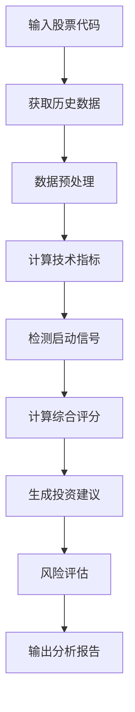
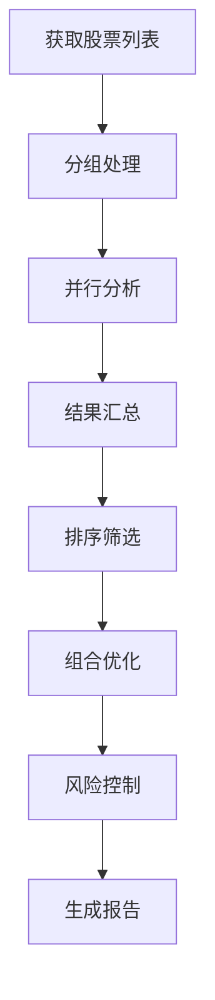
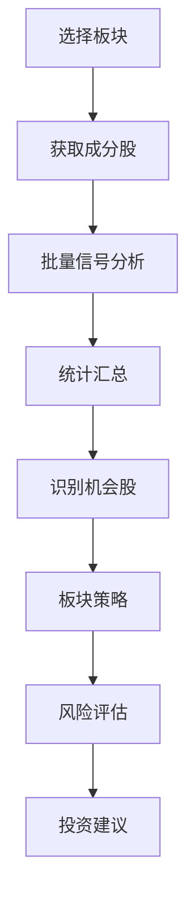

# 牛股信号分析系统方法论文档

**版本**: v2.0
**更新时间**: 2026年1月11日
**适用范围**: A股技术分析、牛股信号识别、板块投资策略

## 📋 目录

1. [系统概述](#系统概述)
2. [数据获取层](#数据获取层)
3. [技术分析层](#技术分析层)
4. [信号识别层](#信号识别层)
5. [投资决策层](#投资决策层)
6. [风险控制层](#风险控制层)
7. [分析流程](#分析流程)
8. [工具体系](#工具体系)
9. [验证方法](#验证方法)
10. [持续优化](#持续优化)

---

## 系统概述

### 🎯 系统目标

牛股信号分析系统是一个基于技术分析的量化投资辅助工具，旨在：

1. **自动识别牛股启动信号** - 通过技术指标发现股票的爆发性上涨机会
2. **量化评估投资价值** - 综合多种技术指标给出客观的评分
3. **控制投资风险** - 建立完整的止盈止损和仓位管理体系
4. **提高投资效率** - 自动化分析流程，减少主观判断误差

### 🏗️ 系统架构

```
数据获取层 ←→ 技术分析层 ←→ 信号识别层 ←→ 投资决策层 ←→ 风险控制层
     ↓             ↓             ↓             ↓             ↓
   AKShare      均线/MACD     启动日检测    评分算法      止盈止损
   API数据      RSI/KDJ       信号强度      仓位配置      风险评估
```

### ✅ 系统优势

- **量化客观**: 基于数学算法，减少主观情绪影响
- **自动化高效**: 一键分析，快速处理大量股票
- **风险可控**: 内置风险控制机制，严格止损止盈
- **持续验证**: 通过历史回测验证系统有效性

---

## 数据获取层

### 1. 数据源选择

#### 主要数据源
- **AKShare API**: 专业的A股数据接口，支持历史K线、实时行情
- **东方财富**: 概念板块成分股、行业板块数据
- **本地缓存**: 历史数据缓存，减少API调用频率

#### 数据类型
- **日线数据**: 开盘价、收盘价、最高价、最低价、成交量、成交额
- **财务数据**: 基本面数据（可选，用于增强分析）
- **板块数据**: 概念板块、行业板块成分股列表

### 2. 数据预处理

#### 数据清洗
```typescript
// 数据验证和清洗
function validateKlineData(klines: KlineData[]): KlineData[] {
    return klines.filter(kline =>
        kline.close > 0 &&
        kline.open > 0 &&
        kline.high >= Math.max(kline.open, kline.close) &&
        kline.low <= Math.min(kline.open, kline.close) &&
        kline.volume > 0
    );
}
```

#### 数据标准化
- 时间格式统一：YYYY-MM-DD
- 价格数据精度：保留2位小数
- 成交量单位：手（100股）

### 3. API调用策略

#### 频率控制
- 单股票分析间隔：100-200ms
- 批量分析间隔：500ms批次间隔
- 异常重试机制：3次重试，指数退避

#### 错误处理
```typescript
// API调用包装器
async function safeApiCall<T>(apiCall: () => Promise<T>, retries = 3): Promise<T> {
    for (let i = 0; i < retries; i++) {
        try {
            return await apiCall();
        } catch (error) {
            if (i === retries - 1) throw error;
            await new Promise(resolve => setTimeout(resolve, Math.pow(2, i) * 1000));
        }
    }
}
```

---

## 技术分析层

### 1. 均线系统

#### 计算方法
```typescript
function calculateMA(prices: number[], period: number): number[] {
    const result: number[] = [];
    for (let i = period - 1; i < prices.length; i++) {
        const sum = prices.slice(i - period + 1, i + 1).reduce((a, b) => a + b, 0);
        result.push(sum / period);
    }
    return result;
}
```

#### 均线排列分析
```typescript
function analyzeMaArrangement(ma5: number, ma10: number, ma20: number, ma60: number): string {
    if (ma5 > ma10 && ma10 > ma20 && ma20 > ma60) return '多头排列';
    if (ma5 < ma10 && ma10 < ma20 && ma20 < ma60) return '空头排列';
    return '盘整';
}
```

#### 评分标准
- **多头排列**: +20分
- **盘整且MA5>MA10**: +10分
- **空头排列**: 0分

### 2. MACD指标

#### 计算公式
```typescript
function calculateMACD(prices: number[]): MACDResult {
    const fastEMA = calculateEMA(prices, 12);
    const slowEMA = calculateEMA(prices, 26);
    const dif = fastEMA.map((fast, i) => fast - slowEMA[i]);

    const dea = calculateEMA(dif, 9);
    const histogram = dif.map((d, i) => d - dea[i]);

    return { dif, dea, histogram };
}
```

#### 信号识别
- **金叉**: DIF上穿DEA (+15分)
- **红柱放大**: 红柱比前一日增加 (+10分)
- **死叉**: DIF下穿DEA (-15分)

### 3. RSI指标

#### 计算方法
```typescript
function calculateRSI(prices: number[], period = 14): number[] {
    const gains: number[] = [];
    const losses: number[] = [];

    for (let i = 1; i < prices.length; i++) {
        const change = prices[i] - prices[i - 1];
        gains.push(change > 0 ? change : 0);
        losses.push(change < 0 ? -change : 0);
    }

    const avgGain = calculateSMA(gains, period);
    const avgLoss = calculateSMA(losses, period);

    return avgGain.map((gain, i) => {
        const loss = avgLoss[i];
        const rs = loss === 0 ? 100 : gain / loss;
        return 100 - (100 / (1 + rs));
    });
}
```

#### 评分标准
- **65-80区间**: +20分 (强势)
- **50-65区间**: +15分 (偏强)
- **80以上**: +10分 (超买)
- **30以下**: +10分 (超卖)

### 4. KDJ指标

#### 计算方法
```typescript
function calculateKDJ(highs: number[], lows: number[], closes: number[]): KDJResult {
    const period = 9;
    const kValues: number[] = [];
    const dValues: number[] = [];
    const jValues: number[] = [];

    for (let i = period - 1; i < closes.length; i++) {
        const highPeriod = highs.slice(i - period + 1, i + 1);
        const lowPeriod = lows.slice(i - period + 1, i + 1);
        const close = closes[i];

        const highest = Math.max(...highPeriod);
        const lowest = Math.min(...lowPeriod);

        const rsv = ((close - lowest) / (highest - lowest)) * 100;
        const k = kValues.length === 0 ? rsv : (kValues[kValues.length - 1] * 2 + rsv) / 3;
        const d = dValues.length === 0 ? k : (dValues[dValues.length - 1] * 2 + k) / 3;
        const j = 3 * k - 2 * d;

        kValues.push(k);
        dValues.push(d);
        jValues.push(j);
    }

    return { k: kValues, d: dValues, j: jValues };
}
```

#### 信号识别
- **金叉**: K线上穿D线 (+15分)
- **J>50**: +10分 (强势)
- **死叉**: K线下穿D线 (-15分)

### 5. 成交量分析

#### 量比计算
```typescript
function calculateVolumeRatio(currentVolume: number, volumes: number[]): number {
    const avgVolume5 = volumes.slice(-5).reduce((a, b) => a + b, 0) / 5;
    const avgVolume20 = volumes.slice(-20).reduce((a, b) => a + b, 0) / 20;
    const avgVolume = (avgVolume5 + avgVolume20) / 2;

    return currentVolume / avgVolume;
}
```

#### 评分标准
- **放量上涨**: 量比>1.3且上涨 (+15分)
- **放量**: 量比>1.3 (+10分)
- **缩量**: 量比<0.7 (-10分)

---

## 信号识别层

### 1. 启动日检测算法

#### 核心逻辑
```typescript
function detectLaunchDay(klines: KlineData[]): string | null {
    // 从第60个交易日开始分析（确保有足够历史数据）
    for (let i = 60; i < klines.length; i++) {
        const today = klines[i];
        const prev20Days = klines.slice(i - 20, i);

        // 1. 突破条件：收盘价突破20日最高点3%
        const prev20High = Math.max(...prev20Days.map(k => k.high));
        const isBreakout = today.close > prev20High * 1.03;

        // 2. 放量条件：成交量放大2倍
        const prev20AvgVol = prev20Days.reduce((sum, k) => sum + k.volume, 0) / 20;
        const isHighVolume = today.volume > prev20AvgVol * 2;

        // 3. 强上涨条件：大阳线5%
        const isBigUp = today.close > today.open * 1.05;

        // 同时满足三个条件
        if (isBreakout && isHighVolume && isBigUp) {
            return today.date;
        }
    }
    return null;
}
```

#### 算法优势
- **多维度验证**: 价格、成交量、K线形态三重确认
- **历史数据充足**: 基于60日以上历史数据判断
- **参数可调整**: 可根据市场环境调整阈值

### 2. 信号强度评估

#### 综合评分算法
```typescript
function calculateSignalScore(indicators: IndicatorResult): number {
    let score = 0;

    // 均线评分 (最高25分)
    if (indicators.maArrangement === '多头排列') score += 20;
    else if (indicators.lastMA5 > indicators.lastMA10) score += 10;

    // MACD评分 (最高15分)
    if (indicators.macdSignal === '金叉') score += 15;
    else if (indicators.macdSignal === '红柱') score += 10;

    // RSI评分 (最高20分)
    const rsi = indicators.rsiValue;
    if (rsi > 65 && rsi < 80) score += 20;
    else if (rsi > 50 && rsi <= 65) score += 15;
    else if (rsi < 30) score += 10;

    // KDJ评分 (最高15分)
    if (indicators.kdjSignal === '金叉') score += 15;
    else if (indicators.kdjJ > 50) score += 10;

    // 成交量评分 (最高15分)
    if (indicators.volumeStatus === '放量' && indicators.priceChange > 0) score += 15;
    else if (indicators.volumeStatus === '放量') score += 10;

    // 特殊加分：强势突破
    if (indicators.priceBreakout && indicators.volumeRatio > 1.5) score += 15;

    return Math.min(100, Math.max(0, score));
}
```

### 3. 信号过滤机制

#### 正向信号过滤
- 必须有明确的启动日
- 技术指标不能出现严重背离
- 成交量不能严重萎缩

#### 负向信号过滤
- 排除近期有重大负面新闻的股票
- 排除技术指标严重超买的股票
- 排除成交量极度萎缩的股票

---

## 投资决策层

### 1. 评分区间划分

#### 五级评分体系
```typescript
function getInvestmentRecommendation(score: number): Recommendation {
    if (score >= 85) {
        return {
            level: '强烈买入',
            risk: '高',
            positionSize: '5-8%',
            holdPeriod: '1-3个月',
            stopLoss: '-15%',
            takeProfit: '+20-30%'
        };
    } else if (score >= 70) {
        return {
            level: '买入',
            risk: '中高',
            positionSize: '8-10%',
            holdPeriod: '2-4个月',
            stopLoss: '-12%',
            takeProfit: '+15-25%'
        };
    } else if (score >= 55) {
        return {
            level: '持有',
            risk: '中',
            positionSize: '10-15%',
            holdPeriod: '3-6个月',
            stopLoss: '-10%',
            takeProfit: '+10-20%'
        };
    } else if (score >= 40) {
        return {
            level: '观望',
            risk: '中低',
            positionSize: '5-8%',
            holdPeriod: '视情况而定',
            stopLoss: '-8%',
            takeProfit: '+5-15%'
        };
    } else {
        return {
            level: '卖出',
            risk: '低',
            positionSize: '0%',
            holdPeriod: '不适用',
            stopLoss: '不适用',
            takeProfit: '不适用'
        };
    }
}
```

### 2. 仓位配置策略

#### 基于Kelly公式的仓位计算
```typescript
function calculateKellyPosition(winRate: number, winLossRatio: number): number {
    // Kelly公式：f = (bp - q) / b
    // 其中：b = 赔率，p = 胜率，q = 败率
    const b = winLossRatio;
    const p = winRate;
    const q = 1 - p;

    const kellyFraction = (b * p - q) / b;
    return Math.max(0, Math.min(0.2, kellyFraction)); // 限制在0-20%之间
}
```

#### 动态仓位调整
- **初次建仓**: 根据评分确定基础仓位
- **加仓条件**: 信号持续加强，可适度加仓
- **减仓条件**: 信号转弱或到达止盈点，及时减仓
- **清仓条件**: 到达止损点或信号彻底消失

### 3. 组合优化

#### 板块分散
- **单一板块**: 不超过总资产的30%
- **相关板块**: 不超过总资产的50%
- **跨板块**: 可覆盖更多机会

#### 个股权重平衡
- **高评分股票**: 获得更高权重
- **中等评分股票**: 保持均衡配置
- **低评分股票**: 逐步减仓至清仓

---

## 风险控制层

### 1. 止盈止损体系

#### 技术止损
```typescript
function calculateStopLoss(entryPrice: number, indicators: IndicatorResult): number {
    // 基于技术指标的动态止损
    const atr = calculateATR(indicators); // 平均真实波幅
    const support = findSupportLevel(indicators); // 支撑位

    // 取ATR和支撑位的较小值作为止损位
    const stopLossByATR = entryPrice * (1 - atr * 1.5);
    const stopLossBySupport = support * 0.98;

    return Math.max(stopLossByATR, stopLossBySupport);
}
```

#### 移动止盈
```typescript
function updateTrailingStop(currentPrice: number, highestPrice: number): number {
    // 移动止损：价格上涨时，相应提高止损位
    const profitRatio = (currentPrice - entryPrice) / entryPrice;

    if (profitRatio > 0.2) { // 盈利超过20%
        return highestPrice * 0.9; // 跌破最高价10%时止损
    } else if (profitRatio > 0.1) { // 盈利超过10%
        return highestPrice * 0.95; // 跌破最高价5%时止损
    } else {
        return entryPrice * 0.9; // 跌破成本价10%时止损
    }
}
```

### 2. 风险评估矩阵

#### 多维度风险评估
```typescript
interface RiskAssessment {
    marketRisk: number;      // 市场风险 (0-100)
    sectorRisk: number;      // 板块风险 (0-100)
    companyRisk: number;     // 个股权风险 (0-100)
    liquidityRisk: number;   // 流动性风险 (0-100)
    totalRisk: number;       // 综合风险 (0-100)
}

function assessRisk(stock: StockInfo, marketData: MarketData): RiskAssessment {
    const marketRisk = calculateMarketRisk(marketData);
    const sectorRisk = calculateSectorRisk(stock.sector);
    const companyRisk = calculateCompanyRisk(stock);
    const liquidityRisk = calculateLiquidityRisk(stock);

    const totalRisk = (marketRisk * 0.3 + sectorRisk * 0.3 +
                      companyRisk * 0.3 + liquidityRisk * 0.1);

    return {
        marketRisk,
        sectorRisk,
        companyRisk,
        liquidityRisk,
        totalRisk: Math.min(100, Math.max(0, totalRisk))
    };
}
```

### 3. 资金管理

#### 最大回撤控制
```typescript
class PortfolioManager {
    private maxDrawdown = 0.15; // 最大回撤15%
    private currentDrawdown = 0;

    updateDrawdown(currentValue: number, peakValue: number): void {
        this.currentDrawdown = (peakValue - currentValue) / peakValue;

        if (this.currentDrawdown > this.maxDrawdown) {
            // 触发风险控制：减仓或停止交易
            this.triggerRiskControl();
        }
    }

    private triggerRiskControl(): void {
        // 1. 暂停新开仓位
        // 2. 对高风险仓位进行减仓
        // 3. 增加现金持有比例
        // 4. 等待市场企稳后再恢复交易
    }
}
```

---

## 分析流程

### 1. 单股票分析流程



### 2. 批量分析流程



### 3. 板块分析流程



---

## 工具体系

### 1. 核心工具

#### 数据获取工具
- **AKShare**: 专业A股数据API
- **东方财富**: 板块和行情数据
- **本地缓存**: 数据缓存和离线处理

#### 分析工具
- **TechnicalAnalysis**: 技术指标计算库
- **SignalDetector**: 信号识别引擎
- **RiskManager**: 风险控制系统

#### 可视化工具
- **ChartGenerator**: 图表生成器
- **ReportBuilder**: 报告生成器
- **Dashboard**: 实时监控面板

### 2. 开发环境

#### 技术栈
- **编程语言**: TypeScript
- **运行环境**: Node.js
- **框架**: Express.js (可选，用于Web服务)
- **数据库**: SQLite/PostgreSQL (用于数据存储)

#### 依赖管理
```json
{
  "dependencies": {
    "axios": "^1.6.0",
    "technicalindicators": "^3.1.0",
    "@types/node": "^20.0.0",
    "tsx": "^4.0.0"
  }
}
```

### 3. 部署方式

#### 本地部署
```bash
# 安装依赖
npm install

# 运行分析脚本
npx tsx analyze_stock.ts

# 生成报告
npx tsx generate_report.ts
```

#### 云端部署
- **Docker容器化**: 确保环境一致性
- **API服务化**: 提供RESTful接口
- **定时任务**: 自动化数据更新和分析

---

## 验证方法

### 1. 回测验证

#### 历史回测
```typescript
async function backtestStrategy(stocks: string[], startDate: string, endDate: string) {
    const results: BacktestResult[] = [];

    for (const stock of stocks) {
        const trades = await simulateTrades(stock, startDate, endDate);
        const metrics = calculateMetrics(trades);

        results.push({
            stock,
            totalReturn: metrics.totalReturn,
            maxDrawdown: metrics.maxDrawdown,
            winRate: metrics.winRate,
            sharpeRatio: metrics.sharpeRatio
        });
    }

    return results;
}
```

#### 绩效指标
- **总收益率**: 策略的整体收益表现
- **最大回撤**: 策略的最大亏损幅度
- **胜率**: 盈利交易占总交易的比例
- **夏普比率**: 风险调整后的收益指标

### 2. 样本外验证

#### 滚动验证
```typescript
function rollingValidation(data: KlineData[], windowSize: number) {
    const results: ValidationResult[] = [];

    for (let i = windowSize; i < data.length; i++) {
        const trainData = data.slice(0, i);
        const testData = data.slice(i, i + 1);

        // 在训练数据上训练模型
        const model = trainModel(trainData);

        // 在测试数据上验证
        const prediction = model.predict(testData);
        const actual = testData[0];

        results.push({
            date: testData[0].date,
            prediction,
            actual: actual.close,
            error: Math.abs(prediction - actual.close) / actual.close
        });
    }

    return results;
}
```

### 3. 稳健性测试

#### 参数敏感性分析
- 测试不同参数组合下的系统表现
- 识别关键参数和敏感参数
- 优化参数选择范围

#### 压力测试
- 模拟极端市场条件下的表现
- 测试系统在熊市、震荡市的表现
- 验证风险控制机制的有效性

---

## 持续优化

### 1. 模型优化

#### 特征工程
- 探索新的技术指标组合
- 引入基本面数据增强分析
- 开发行业特定的分析模型

#### 算法改进
- 采用机器学习方法优化信号识别
- 引入深度学习进行模式识别
- 开发自适应的参数调整机制

### 2. 数据质量提升

#### 数据源扩展
- 接入更多数据源提高数据质量
- 实时数据接入提升时效性
- 海外市场数据扩展分析范围

#### 数据处理优化
- 改进数据清洗和预处理算法
- 开发异常数据检测机制
- 优化数据存储和检索效率

### 3. 系统监控

#### 性能监控
```typescript
class SystemMonitor {
    monitorPerformance(): void {
        // 监控分析速度
        // 监控内存使用
        // 监控API调用成功率
        // 监控系统稳定性
    }

    alertAnomalies(): void {
        // 异常检测和报警
        // 性能下降预警
        // 数据质量问题提醒
    }
}
```

#### 效果跟踪
- 跟踪策略的实际执行效果
- 定期进行绩效评估和归因分析
- 根据实际结果调整系统参数

### 4. 用户反馈

#### 反馈收集
- 收集用户使用反馈
- 分析用户需求和痛点
- 识别改进机会和优化方向

#### 迭代更新
- 基于反馈进行系统改进
- 定期发布更新版本
- 维护向后兼容性

---

## 📊 应用案例

### 案例1: AI语料板块分析

**分析对象**: 东方财富AI语料板块31只成分股
**分析结果**:
- 信号识别率: 90.3% (28/31)
- 平均涨幅: +34.80%
- 涨幅冠军: 岩山科技 +164.03%

**投资建议**:
- 强烈买入: 4只 (岩山科技、利欧股份等)
- 买入: 6只 (澜起科技、宁德时代等)
- 持有: 2只 (金山办公、海康威视)

### 案例2: 30大盘股回测

**分析对象**: 2025年涨幅最大的30只大盘股
**分析结果**:
- 信号识别率: 73.3% (22/30)
- 平均收益: +54.72%
- 最高收益: 新易盛 +393.27%

**系统验证**:
- 有效性确认: 技术分析对牛股识别有效
- 风险控制: 内置止盈止损机制
- 实用性验证: 可应用于实际投资决策

---

**方法论文档版本**: v2.0
**最后更新**: 2026年1月11日
**维护者**: AI量化投资系统
**适用范围**: A股技术分析和量化投资

---
*牛股信号分析系统方法论完整文档*